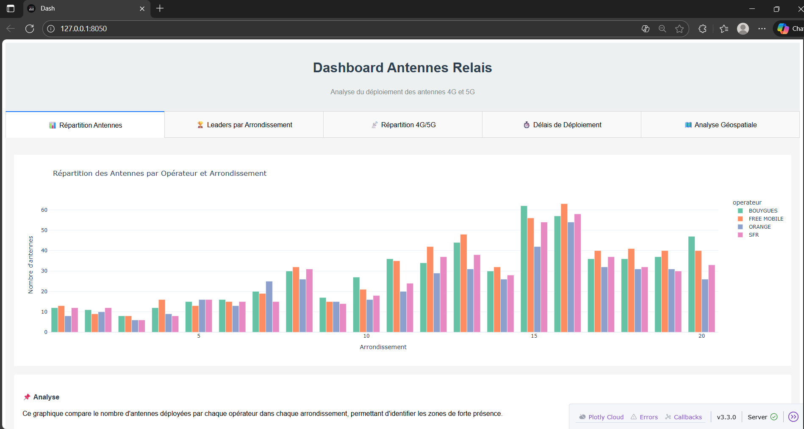
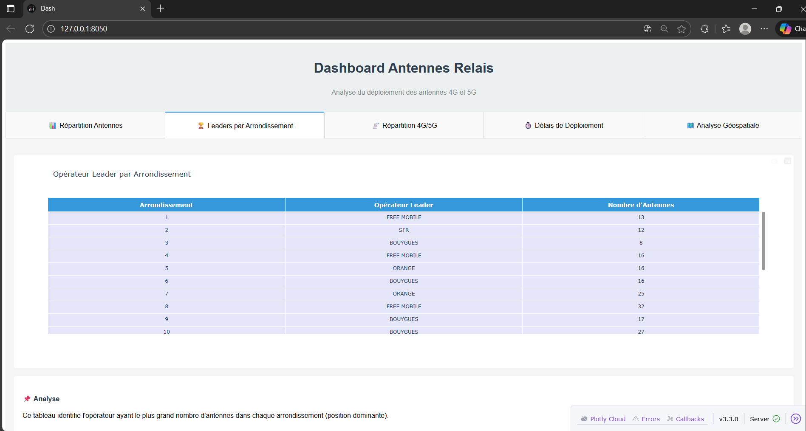
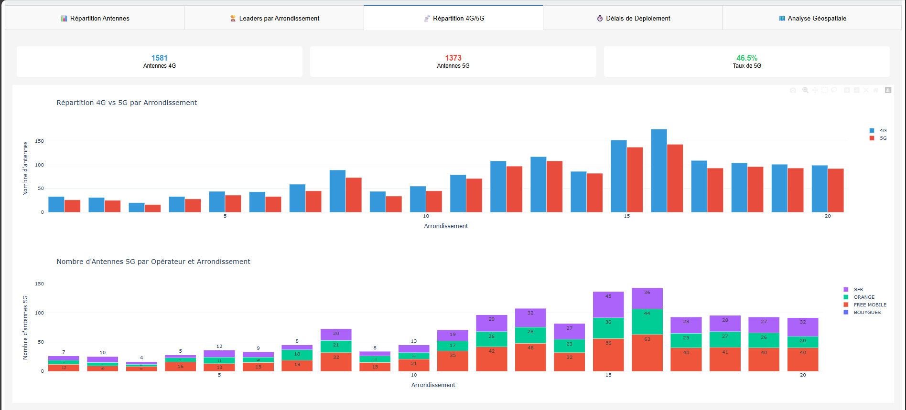
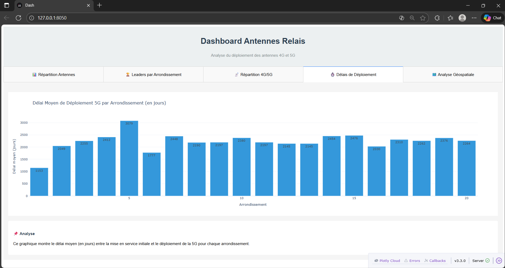
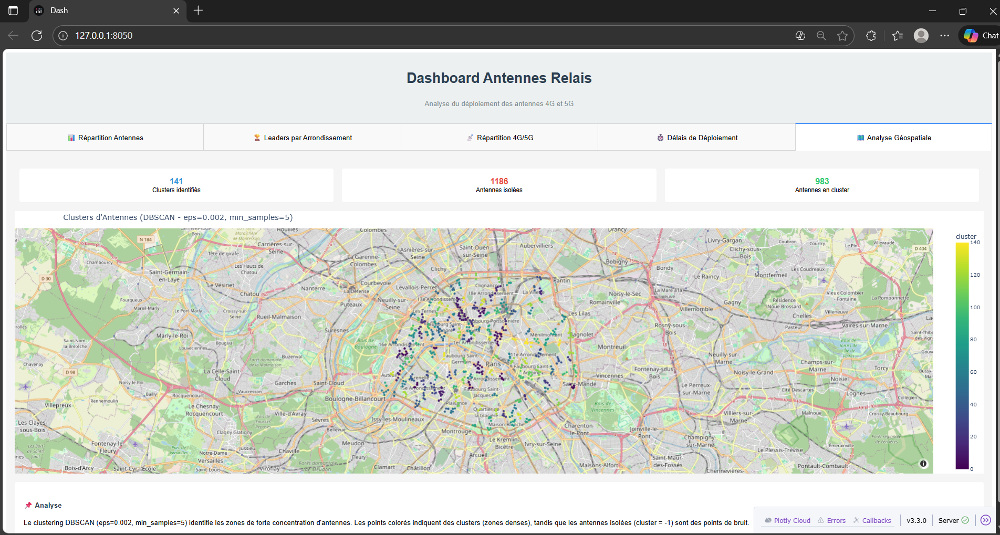

# Projet : Analyse et Visualisation des Antennes Relais à Paris

Ce projet vise à analyser et visualiser le déploiement des antennes relais (3G, 4G, 5G) dans les différents arrondissements de Paris. Il comprend un pipeline complet allant de la récupération des données à la création d'un tableau de bord interactif.


##  Étapes 

### 1. Récupération des Données

- **Objectif** : Collecter les données des antennes relais à Paris.
- **Source** : API Open Data de la ville de Paris.
- **Script utilisé** : [`notebooks/data_collection.ipynb`](notebooks/data_collection.ipynb)
- **Résultat** : Les données brutes sont sauvegardées dans le fichier [`data/antennes.csv`](data/antennes.csv).

---

### 2. Nettoyage et Traitement des Données

- **Objectif** : Préparer les données pour l'analyse et la visualisation.
- **Script utilisé** : [`notebooks/data_cleaning.ipynb`](notebooks/data_cleaning.ipynb)
- **Étapes principales** :
  - Gestion des valeurs manquantes (ex. dates de mise en service).
  - Conversion des coordonnées géographiques en objets géométriques (POINT).
  - Extraction des arrondissements à partir des adresses.
  - Validation des données (ex. cohérence des dates entre 3G, 4G et 5G).

---

### 3. Chargement dans la Base de Données

- **Objectif** : Stocker les données dans une base PostgreSQL avec l'extension PostGIS pour faciliter les analyses géospatiales.
- **Script utilisé** : [`db_utils.py`](db_utils.py)
- **Pourquoi PostgreSQL/PostGIS ?**
  - **Support natif des données géospatiales** : PostGIS permet de stocker et de manipuler des objets géométriques (ex. POINT, POLYGON).
  - **Performances** : Les index spatiaux (GiST) accélèrent les requêtes géographiques.
  - **Compatibilité** : Intégration facile avec GeoPandas et SQLAlchemy.

---

### 4. Analyse des Données

- **Objectif** : Extraire des statistiques et des insights sur le déploiement des antennes.
- **Script utilisé** : [`notebooks/analysis.ipynb`](notebooks/analysis.ipynb)
- **Analyses réalisées** :
  - **Délais de déploiement** : Calcul des délais entre la mise en service des technologies (3G → 4G → 5G).
  - **Répartition géographique** : Clustering des antennes par densité (algorithme DBSCAN).
  - **Comparaison par opérateur** : Analyse des parts de marché et des performances des opérateurs.
- **Résultat** : Les résultats sont utilisés pour alimenter l'interface.

---

### 5. Création de l'interface

- **Objectif** : Fournir une interface interactive pour explorer les données et les analyses.
- **Script utilisé** : [`dashboard/app.py`](dashboard/app.py)
- **Technologie** : Dash et Plotly.
- **Fonctionnalités** :
  - **Visualisation des délais** : Graphiques montrant les délais de déploiement par arrondissement.
  - **Répartition des antennes** : Cartes interactives avec clustering géographique.
  - **Comparaison des opérateurs** : Graphiques comparant les parts de marché et les performances.
  - **Analyse 4G/5G** : Statistiques sur la couverture des technologies.
- **Accès** : L'interface est accessible à l'adresse `http://localhost:8050`.

---
### 6. Résultats






## Installation

   ```bash
   git clone https://github.com/yasmineelhakem/data_antennes_relais.git
   cd data_antennes_relais  
```
Créer un fichier .env à la racine:
``` bash
DB_USER=postgres
DB_PASSWORD=your_password
DB_HOST=db
DB_PORT=5432
DB_NAME=antennes_db 
``` 

```bash
docker compose build --no-cache 
docker compose up -d 
   ```
L'interface sera disponible sur: http://localhost:8050


